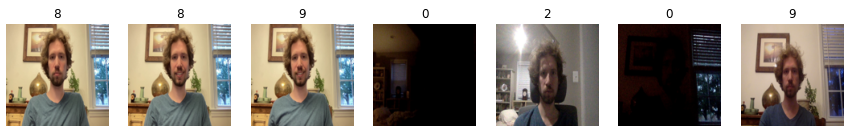

## About
This project attempts to rate images based on the aesthetic preferences learned from the training set. Specifically, the dataset I've used so far is (a few thousand of) [@ratemyskyperoom's](https://twitter.com/ratemyskyperoom) ratings of video-call rooms.

Initial testing shows some ability to predict ratings in the test set (the most recent ~750 rated room tweets):


Initial experiments show that regression seems to yield better results than classification (MSE rather than cross-entropy loss), but more testing could be done. A result of this is that predictions tend to cluster near the average rating -- 8.5 for the training set, despite the rating range of 1-10. If we look at the histogram of ratings we can see clearly why this is the case, and why our performance is particularly poor below a rating of 4 or so. In fact, it's slightly surprising that this even works below a rating of 6: 

Testing on my own images (not officially rated by @ratemyskyperoom) shows reasonable results as well!:


## Install
```
pip install -e .
```

If you wish to download data from twitter you will also need to install the developer version of snscrape:
```
pip3 install git+https://github.com/JustAnotherArchivist/snscrape.git
```
## Test
To test that the code is working run `pytest` from this directory:
```
pytest
```
Note that this currently assumes developer version of snscrape is installed.

## Use
You can download images from twitter by creating a data directory here `mkdir data`, then running
`python3 src/room_rate/data/data_downloader.py` (or import this module for more detailed options)

Remove ratings you want to exclude (e.g. 0) and sort into train/test sets by running `python3 src/room_rate/data/data_organizer.py`. (again, more details in module)

Training and testing in **notebooks/train.ipynb**

## Additional Experiment Notes:

Starting with a pre-trained model (resnet18) does seem to be somewhat advantageous over a randomly initialized resnet18, though only training final layer weights does not work as well as updating all the weights.

### Aditional TODO
- Experiments
    - Treat as classification (e.g. cross-entropy loss) instead of regression
    - Other architectures
    - Over/random-sampling to get (more) even representation across ratings
    - Use (scaled) sigmoid at output for regression (MSE) version
    - Fine-tune a trained model?
- Set up convenient inference flow
